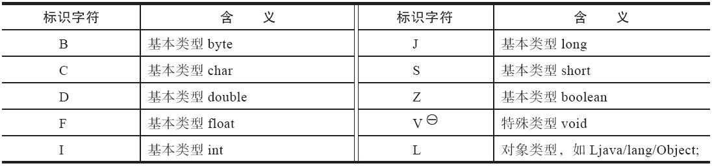
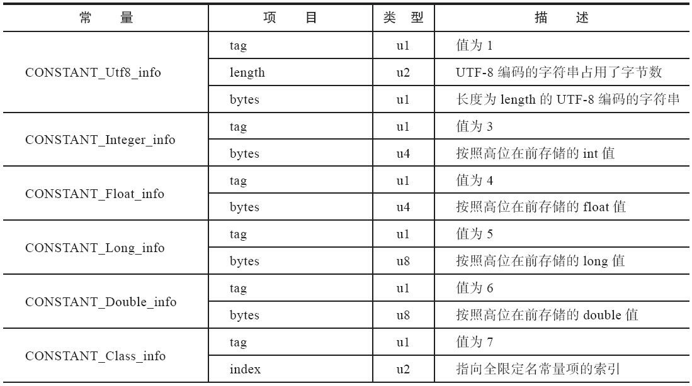
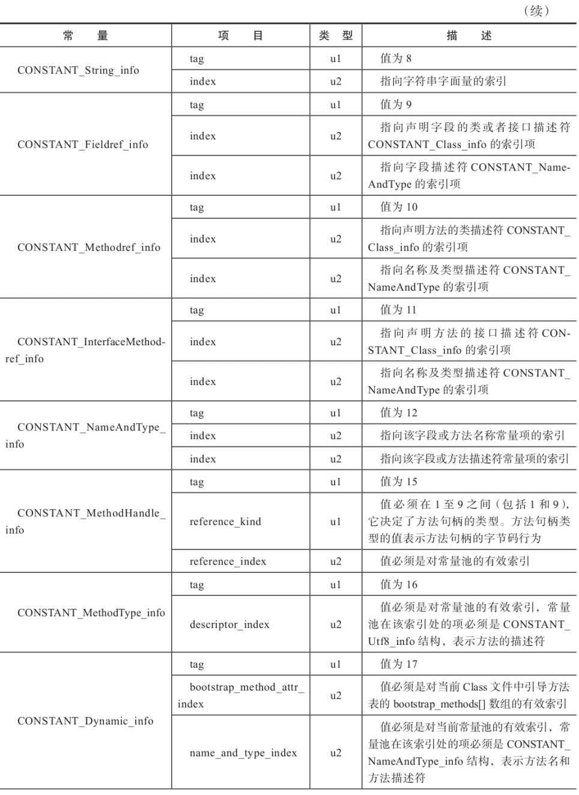
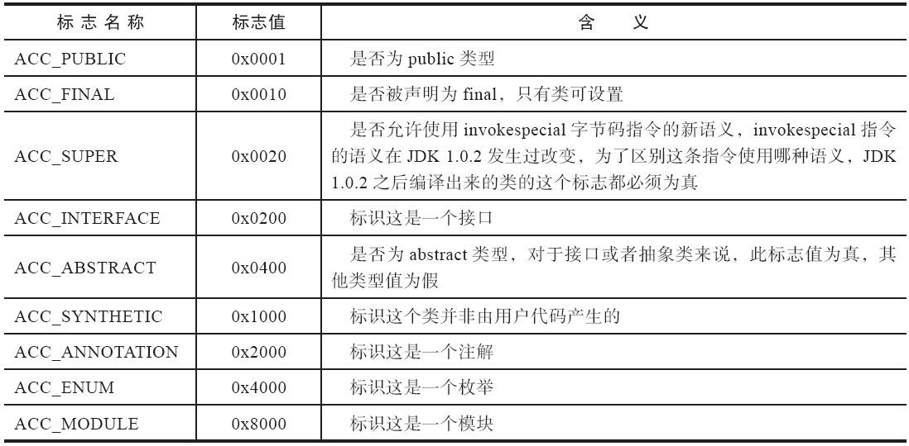
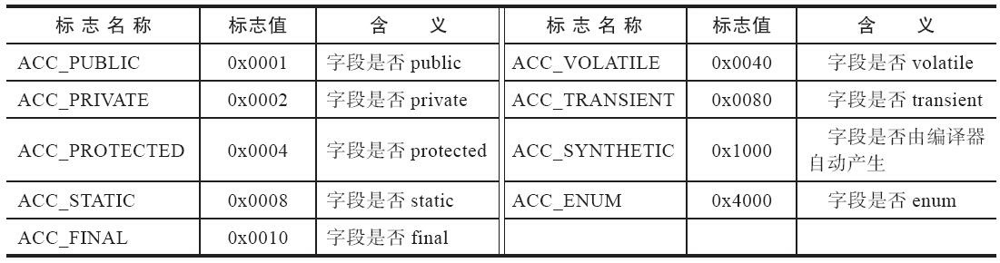

JVM中的Class类文件结构学习。

<!--more-->

Class文件是一组以8字节位基础单位的二进制流，使用类似C语言结构体的伪结构存储数据，只有两种数据类型：无符号数和表。

无符号数用来描述数字、索引引用、数量值或者按照UTF8编码构成的字符串值，分为：

- u1，1个字节
- u2，2个字节
- u4，4个字节
- u8，8个字节

表由多个无符号数或者其他表作为数据项，构成了复合数据类型。

文件格式如下表：

| 类型           | 名称                | 数量                    |
| -------------- | ------------------- | ----------------------- |
| u4             | magic               | 1                       |
| u2             | minor_version       | 1                       |
| u2             | major_version       | 1                       |
| u2             | constant_pool_count | 1                       |
| cp_info        | constant_pool       | constant_pool_count - 1 |
| u2             | access_flags        | 1                       |
| u2             | this_class          | 1                       |
| u2             | super_class         | 1                       |
| u2             | interfaces_count    | 1                       |
| u2             | interfaces          | interfaces_count        |
| u2             | fields_count        | 1                       |
| field_info     | fields              | fields_count            |
| u2             | methods_count       | 1                       |
| method_info    | methods             | methods_count           |
| u2             | attributes_count    | 1                       |
| attribute_info | attributes          | attributes_count        |

可以这样记忆，前面几个先记住：

- 魔数
- 次版本号
- 主版本号
- 常量池数量
- 常量池

后面几个按照我们平时写一个类的顺序来记忆：

- 访问标志
- this_class
- 父类
- 接口数量
- 接口
- 字段数量
- 字段
- 方法数量
- 方法
- 属性数量
- 属性

# 描述符

描述符用来描述：

- 字段的数据类型
- 方法的参数列表（包括数量、类型以及顺序）
- 返回值

描述符标识字符含义：

- 数组类型，每一维度使用一个前置的`[`字符来描述。
- 描述方法时，按照先参数列表，后返回值的顺序描述

# 魔数

Class文件头4个字节是魔数Magic Number，用来确定这个文件是否为一个能被虚拟机接受的Class文件，值是：0xCAFEBABE

# 主次版本号

第5个字节和6个字节是次版本号Minor Version，第7字节和8字节是主版本号Major Version。

高版本的JDK能向下兼容以前版本的Class文件，但不能运行更高版本的Class文件。

# 常量池

一个u2类型表示常量池的容量计数constant_pool_count，从1开始。

常量池主要用来存放：字面量和符号引用。

- 字面量比较接近Java语言层面的常量概念，比如：文本字符串、被声明为final的常量值等。
- 符号引用，主要包括：
  - 被模块导出或者开放的包（Package）
  - 类和接口的全限定名（Fully Qualified Name）
  - 字段的名称和描述符（Descriptor）
  - 方法的名称和描述符
  - 方法句柄和方法类型（Method Handle、Method Type、Invoke Dynamic）
  - 动态调用点和动态常量（Dynamically-Computed Call Site、Dynamically-Computed Constant）

常量池中的常量都是一个表，表的其实第一位是u1类型的标志位，代表当前常量属于哪种常量类型，共有17种常量类型：

| 类型                             | 标志 | 描述                     |
| -------------------------------- | ---- | ------------------------ |
| CONSTANT_Utf8_info               | 1    | UTF-8编码的字符串        |
| CONSTANT_Integer_info            | 3    | 整形字面量               |
| CONSTANT_Float_info              | 4    | 浮点型字面量             |
| CONSTANT_Long_info               | 5    | 长整型字面量             |
| CONSTANT_Double_info             | 6    | 双精度浮点型字面量       |
| CONSTANT_Class_info              | 7    | 类或接口的符号引用       |
| CONSTANT_String_info             | 8    | 字符串类型字面量         |
| CONSTANT_Fieldref_info           | 9    | 字段的符号引用           |
| CONSTANT_Methodref_info          | 10   | 类中方法的符号引用       |
| CONSTANT_InterfaceMethodRef_info | 11   | 接口中方法的符号引用     |
| CONSTANT_NameAndType_info        | 12   | 字段或方法的部分符号引用 |
| CONSTANT_MethodHandle_info       | 15   | 方法句柄                 |
| CONSTANT_MethodType_info         | 16   | 方法类型                 |
| CONSTANT_Dynamic_info            | 17   | 动态计算常量             |
| CONSTANT_InvokeDynamic_info      | 18   | 动态方法调用点           |
| CONSTANT_Module_info             | 19   | 模块                     |
| CONSTANT_Package_info            | 20   | 模块中开放或导出的包     |

## CONSTANT_Class_info

| 类型 | 名称       | 数量 |
| ---- | ---------- | ---- |
| u1   | tag        | 1    |
| u2   | name_index | 1    |

- tag，标志位，用来区分常量类型，CONSTANT_Class_info是7
- name_index，是常量池的索引值，指向常量池中一个CONSTANT_Utf8_info类型常量，代表这个类或接口的全限定名

## CONSTANT_Utf8_info

| 类型 | 名称   | 数量   |
| ---- | ------ | ------ |
| u1   | tag    | 1      |
| u2   | length | 1      |
| u1   | bytes  | length |

- tag，标志位，用来区分常量类型，CONSTANT_Utf8_info是1
- length，表示这个UTF-8编码的字符串长度是多少字节
- bytes，使用UTF-8缩略编码表示的字符串，长度是length

Class文件中方法、字段等都需要引用CONSTANT_Utf8_info类型常量来描述名称，所以Java中方法、字段名的最大程度就是CONSTANT_Utf8_info类型的常量的最大长度，也就是length，u2类型，最大值65535，64KB。

## 常量池数据类型结构汇总图

# 访问标志

常量池后面两个字节表示访问标志，access_flags，表示类或接口层次的访问信息，包括是类还是接口、是否public类型、是否abstract类型，类是否是final等等。

# this_class

this_class类索引，u2类型，用来确定这个类的全限定名，指向一个类型为CONSTANT_Class_info的类描述符常量，通过CONSTANT_Class_info中的索引值可以找到CONSTANT_Utf8_info类型的常量中的全限定名字符串。

# super_class

super_class父类索引，u2类型，用来确定父类的全限定名，指向一个类型为CONSTANT_Class_info的类描述符常量，通过CONSTANT_Class_info中的索引值可以找到CONSTANT_Utf8_info类型的常量中的全限定名字符串。

# interfaces

interfaces接口索引集合，是一组u2类型的数据集合，描述类实现了哪些接口。

interfaces前面有个u2类型的interfaces_count，表示接口索引表容量。

# 字段表集合

field_info字段表，描述类或者接口中声明的变量，包括：静态变量、实例变量，不包括方法中的局部变量。

| 类型           | 名称             | 数量             |
| -------------- | ---------------- | ---------------- |
| u2             | access_flags     | 1                |
| u2             | name_index       | 1                |
| u2             | descriptor_index | 1                |
| u2             | attributes_count | 1                |
| attribute_info | attributes       | attributes_count |

## access_flags

字段修饰符，u2类型，如下

## name_index

name_index是对常量池项的引用，表示字段的简单名称。

## descriptor_index

descriptor_index是对常量池项的引用，表示字段和方法的描述符。

## attributes

属性表集合，存储一些额外信息，比如`final static int m = 123`可能会存在一项名为ConstantValue的属性，指向常量123。

字段表集合不会列出从父类或者父接口继承来的字段，但有可能会出现Java代码中不存在的字段，比如内部类中为了保持对外部类的访问性，编译器会自动添加指向外部类实例的字段。

# 方法表集合

