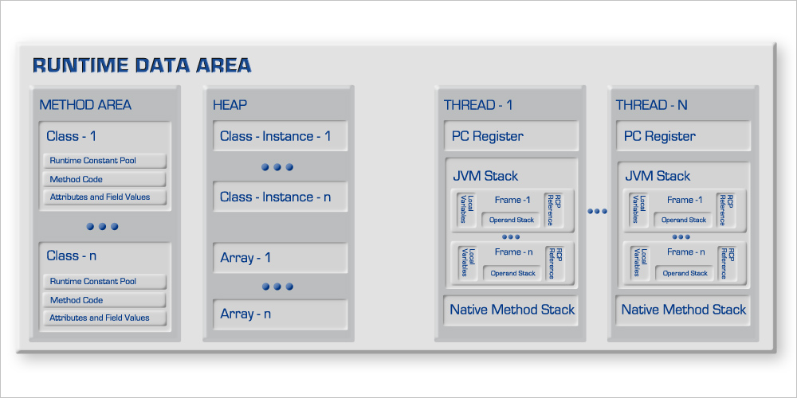
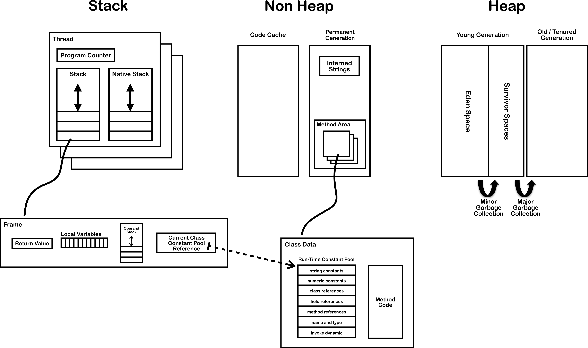

JVM中的方法区、永久代、元空间学习。

<!--more-->

JVM运行时数据区域：

图片来自：https://blog.codecentric.de/en/2010/01/the-java-memory-architecture-1-act/

图片来自：https://blog.jamesdbloom.com/JVMInternals.html

Sun HotSopt的实现：

图片来自：https://blog.codecentric.de/en/2010/01/the-java-memory-architecture-1-act/

方法区定义的实现是永久代。

- 方法区：Java虚拟机规范中有方法区的概念，线程共享，存储每一个类的结构信息，比如运行时常量池、字段、方法数据、构造函数、和普通方法的字节码内容、还包括一些在类、实例、接口初始化时用到的特殊方法。虽然方法区是堆的逻辑组成部分，但是简单虚拟机实现可以选择在这个区域不实现垃圾收集。
- 永久代：是对方法区定义的实现，永久代是Hotspot中定义的，其他的虚拟机是没有永久代的。
- 运行时常量池：是一个类或接口的常量池的运行时表示形式，包括编译器可知的字面量、运行期解析后才能获得的方法或字段引用。每个运行时常量池都分配在JVM的方法区中。
- 字符串常量池：在永久代中。

永久代中包含了：字符串常量池和方法区规范中定义的具体实现。

- 在JDK1.6以及之前存在永久代，永久代包含字符串常量池和方法区具体实现
- 在JDK1.7版本中仍然存在永久代，但是字符串常量池被移到了堆中，符号引用移到了本地内存、类的静态变量移到了堆中。
- 在JDK1.8版本移除了永久代，使用与堆不相连的Metaspace元空间来代替永久代，并且元空间不在虚拟机内存中，是用的是本地内存。元空间也是对Java虚拟机规范中的方法区定义的具体实现。

为什么移除永久代：

1. 字符串常量池存在永久代中，容易出现性能问题和内存溢出
2. 永久代大小不容易确定，PermSize指定太小容易造成永久代OOM
3. 永久代会为GC带来不必要的复杂度，并且回收效率偏低
4. Oracle 可能会将HotSpot 与 JRockit 合二为一

