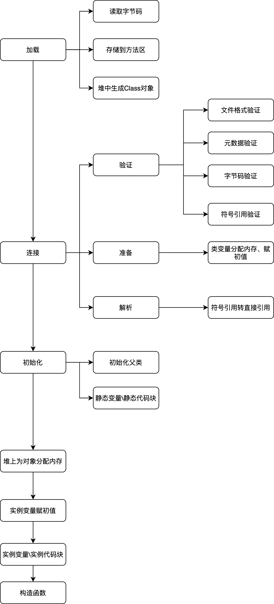

JVM中类的生命周期有加载、连接（验证、准备、解析）初始化、使用、卸载。

<!--more-->

类的生命周期总共分为七个阶段：

- 加载
- 连接（验证、准备、解析）
- 初始化
- 使用
- 卸载

使用drawio画了一张图，这里是源文件：[JVM类加载机制](JVM类加载机制.drawio)



# 加载

类加载过程的第一步就是加载阶段，加载阶段主要做的事情有：

- 通过一个类的全限定名获取其定义的二进制字节流。
- 将字节流代表的静态存储结构转化为方法区的运行时数据结构。
- 在Java堆中生成一个代表这个类的java.lang.Class对象，作为方法区中这个类的访问的入口。

加载阶段完成后，虚拟机外部的二进制字节流就按照虚拟机所需的格式存储在方法区中，同时在堆中生成了一个java.lang.Class对象，这样就可以通过该对象访问方法区中的类的数据。

# 连接

类加载的第二个大阶段是连接，连接又包括了验证、准备、解析三个阶段。

## 验证

其中验证阶段主要做的事情是确保被加载的类的正确性，主要分为4个阶段的验证：

- 文件格式验证：验证二进制字节流是否符合Class文件格式的规范。例如是否以0xCAFEBABE开头、次版本号和主版本号是否正确、常量池中常量是否有不被支持的类型等等。
- 元数据的验证：对字节码描述的信息进行语义分析，保证描述的信息符合Java语言的规范要求，如：这个类是否有父类，除了java.lnag.Object之外。
- 字节码的验证：通过数据流和控制流分析，确定程序语意是合法的、符合逻辑的。
- 符号引用验证：确保解析动作能正确执行。

验证阶段是非常重要的，但是不是必须的，可以关闭来缩短虚拟机类加载的时间。

## 准备

准备阶段是为类变量分配内存，并设置类变量的初始值阶段，内存都将在**方法区**中分配。有几点需要注意：

1. 这时候进行的内存分配仅包括类变量（static），而不包括实例变量，实例变量会在对象实例化的时候随着对象一起分配在Java堆中。

2. 这里设置的初始值通常情况下是数据类型默认的零值（0，0L，null，false等），而不是在Java代码中显式赋予的值。而把代码中显式赋予的值赋值给变量的操作是在初始化阶段执行的，存放于类构造器`<clinit>()`中。

   关于默认值也有几点要注意的：

   - 如果是基本数据类型，对于类变量（static）和全局变量，如果不显式的对其赋值而直接使用， 系统会为其赋予默认零值；而对于局部变量来说，使用前必须显式的为其赋值，否则编译不通过。
   - 如果是同时被static和final修饰的常量，必须在声明的时候为其显式的赋值，否则编译不通过；对于只被final修饰的常量，既可以在声明时显式的为其赋值，也可以在类初始化的时候为其显式的赋值，总之，在使用前必须为其显式的赋值，系统不会为其赋予默认零值。
   - 如果是引用数据类型reference，如果没有显示的赋值，则会赋予默认零值：null。
   - 如果是数组，在初始化的时候没有对数组中的各元素赋值，那么其中的元素将根据对应的数据类型赋予默认的零值。

3. 如果类字段的字段表属性中存在ConstantValue属性，即同时被final和static修饰，那么在准备阶段变量就会被初始化为ConstantValue。如：`public static final int value = 3`，编译时会为value生成ConstantValue属性，在准备阶段虚拟机会根据ConstantValue的设置将value赋值为3。static final常量在编译期就将其结果放入了调用它的类的常量池中。

## 解析

解析阶段是要把类中的符号引用转换为直接引用的阶段。虚拟机将常量池中的符号引用替换为直接引用。解析动作主要针对类或接口、字段、类方法、接口方法、方法类型、方法句柄、调用点限定符等7类符号引用进行。

# 初始化

初始化阶段为类的静态变量赋予正确的初始值。JVM负责对类进行初始化，主要是对类变量进行初始化，Java中对类变量进行初始值设定有两种方式：

- 声明类变量的时候指定初始值。
- 在静态代码块中为类变量指定初始值。

## 类初始化的先后顺序

- 如果一个类还没有被加载和连接，则先进行加载和连接。
- 如果该类的父类还没有被初始化，则先初始化直接父类。
- 如果该类中有初始化语句，则系统依次执行这些初始化语句。

## 类初始化的时机

可分为主动引用和被动引用：

- 主动引用，会触发初始化。
- 被动引用，不会触发初始化。

### 主动引用情形

主动引用会触发类的初始化：

- 使用new关键字创建类的实例。
- 访问某个类或接口的静态变量，或者为该静态变量赋值。
- 调用一个类的静态方法。
- 通过反射调用。
- 初始某个类的子类，则其父类也会被初始化。
- Java虚拟机启动时被标明为启动类的类。
- 当使用 JDK.7 的动态语言支持时，如果一个java.lang.invoke.MethodHandle 实例最后的解析结果为 REF_getStatic, REF_putStatic, REF_invokeStatic 的方法句柄，并且这个方法句柄所对应的类没有进行过初始化，则需要先触发其初始化。

### 被动引用情形

被动引用不会触发类的初始化：

- 子类引用父类的静态字段，不会导致子类初始化，只有直接定义静态字段的类才会被触发初始化，所以子类不会初始化。
- 通过数组来引用类，不会触发类的初始化，初始化的是数组，数组应用的类并不需要初始化。
- 常量不会触发类的初始化，常量在编译阶段会存入常量池中。

# 结束生命周期

- 执行System.exit()方法。
- 程序正常执行结束。
- 程序在执行过程中遇到了异常或错误而终止。
- 操作系统出现错误导致Java虚拟机进程终止。

# 类初始化顺序总结

不考虑有父类的：

```
静态变量\静态代码块 --> 实例变量\实例代码块 --> 构造方法
```

有父类的：

```
父类静态变量\静态代码块 --> 子类静态变量\静态代码块 --> 父类实例变量\实例代码块 --> 父类构造方法 --> 子类实例变量\实例代码块 --> 子类构造方法
```

# 参考

- https://blog.jamesdbloom.com/JVMInternals.html