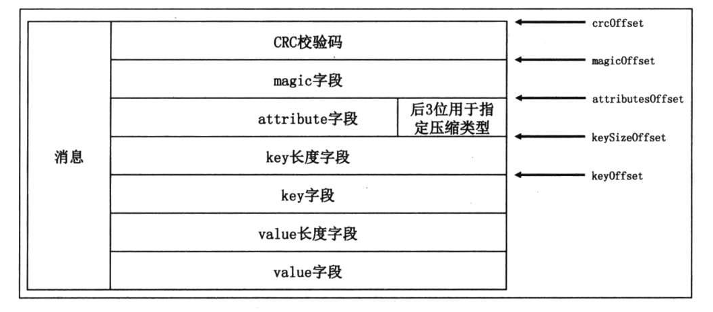

初识Kafka。

Kafka的Broker学习。

<!--more-->

Broker主要功能是持久化消息和将消息队列中的消息从发送端传输到消费端。

# 消息设计

Kafka消息实现方式本质使用ByteBuffer保存消息，同时依赖文件系统提供的页缓存机制，不依靠Java的堆缓存。ByteBuffer是紧凑的二进制字节结构，不需要padding操作，省去了很多不必要的对象开销。

## V0消息格式

- CRC，4字节，CRC校验码
- magic，1字节，版本号，V0、V1、V2分别是0、1、2
- attribute，1字节，属性，目前只使用低3位表示消息压缩类型
- key长度，4字节，未指定key为-1
- key值
- value长度，4字节，未指定value为-1
- value值

## V1消息格式

- V1增加了时间戳信息
- attribute字段第4位用于指定时间戳类型

## V0、V1日志项格式

## V2消息格式

- 消息总长度
- 时间戳增量，不再使用8字节保存时间戳信息，而是保存增量
- 位移增量
- 消息头部，用来满足一些定制化需求
- 去除消息级CRC校验
- 废弃attribute字段

## V2 batch格式

- CRC，消息级的CRC移除，放入batch
- attribute，消息级的attribute被废弃。低3位保存压缩类型，第4位保存时间戳类型，5、6位保存事务类型和控制类型

# 集群管理

Kafka支持自动化服务发现和成员管理，是基于Zookeeper实现，当一个Broker启动的时候会将自己注册到Zookeeper下的一个节点。

# 副本和ISR

Kafka分区本质上是一个备份日志，利用多份相同的备份共同提供冗余机制来保持系统高可用性。这些备份称为副本replica。

Kafka把分区所有副本均匀的分配到所有broker上，并从这个副本中挑选一个作为leader副本对外提供服务，其他副本称为follower副本，只能被动向leader副本请求数据，保持和leader的同步。

ISR，in-sync replicas，是Kafka集群动态维护的一组同步副本集合，每个topic分区都有自己的ISR列表，ISR中的所有副本都于leader保持同步状态，leader副本总是包含在ISR中的，只有ISR中的副本才有资格被选举为leader。Producer写入的一条消息只有被ISR中所有副本都接收到，才被视为已提交状态。

# 参考

- Apache kafka实战