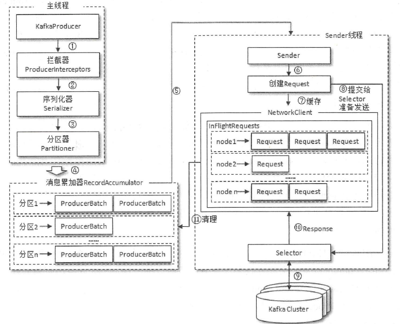

Kafka的Producer学习。

<!--more-->

- 序列化，生产者需要用序列化器Serializer把对象转化成字节数组，才能通过网络发送给Kafka
- 分区器，Partitioner，为消息分配分区，默认分区器DefaultPartitioner，key不为null，会对key进行哈希来计算分区号；如果key为null，消息会以轮询的方式发往主题内各个可用分区
- 拦截器，Interceptor

# Producer架构

- RecordAccumulator，消息累加器或者消息收集器，用来缓存消息，以便Sender线程可以批量发送，减少网络传输的消耗提升性能。RecordAccumulator内部为每个分区维护一个双端队列，发送的消息都被追加到双端队列中，队列中内容是ProducerBatch，ProducerBatch中包含一个或多个ProducerRecord。
- Sender，会从RecordAccumulator中获取缓存的消息，将消息发送出去
- Request，是Kafka的各种协议请求，这里是ProduceRequest
- InFlightRequests，用来缓存已经发出去但还没有收到响应的请求

Producer是线程安全的，可以在多线程环境中复用。

# 参考

- Apache kafka实战
- 深入理解Kafka：核心设计与实践原理